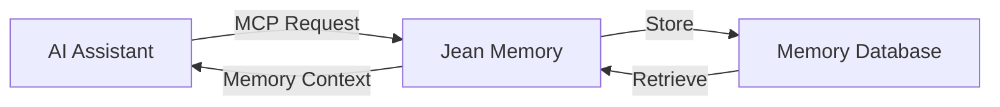

## What is MCP?

Model Context Protocol (MCP) is an open standard that enables AI assistants like Claude, ChatGPT, and Cursor to connect with external tools and data sources.

## Supported Platforms

<CardGroup cols={3}>
  <Card
    title="Claude Desktop"
    icon="robot"
    href="/mcp/claude-desktop"
  >
    Native MCP support with OAuth
  </Card>
  <Card
    title="ChatGPT"
    icon="message"
    href="/mcp/chatgpt"
  >
    Custom GPT integration
  </Card>
  <Card
    title="Cursor"
    icon="code"
    href="/mcp/cursor"
  >
    IDE-integrated AI coding
  </Card>
</CardGroup>

## How It Works



## Quick Setup

<Tabs>
  <Tab title="Claude Desktop">
    1. Open Claude Desktop settings
    2. Go to Developer > MCP Servers
    3. Add Jean Memory server:
    
    ```json
    {
      "jean-memory": {
        "command": "npx",
        "args": ["-y", "@jean-technologies/mcp-server"]
      }
    }
    ```
    
    4. Restart Claude Desktop
    5. Authorize with OAuth when prompted
  </Tab>
  
  <Tab title="ChatGPT">
    1. Visit [ChatGPT Store](https://chat.openai.com/gpts)
    2. Search for "Jean Memory"
    3. Click "Start Chat"
    4. Authorize access when prompted
  </Tab>
  
  <Tab title="Cursor">
    1. Open Cursor Settings
    2. Navigate to AI > MCP
    3. Add Jean Memory configuration:
    
    ```json
    {
      "mcp": {
        "servers": {
          "jean-memory": {
            "command": "npx",
            "args": ["-y", "@jean-technologies/mcp-server"]
          }
        }
      }
    }
    ```
    
    4. Reload window
  </Tab>
</Tabs>

## Available Tools

When connected via MCP, AI assistants can access these memory tools:

<AccordionGroup>
  <Accordion title="jean_memory" icon="brain">
    **Primary tool for context-aware conversations**
    
    Intelligently retrieves relevant memories based on the conversation context.
    
    ```json
    {
      "name": "jean_memory",
      "arguments": {
        "user_message": "What did we discuss about the project?",
        "is_new_conversation": false,
        "needs_context": true
      }
    }
    ```
  </Accordion>
  
  <Accordion title="add_memories" icon="plus">
    **Store new information**
    
    Save important information from conversations.
    
    ```json
    {
      "name": "add_memories",
      "arguments": {
        "text": "Project deadline is March 15th"
      }
    }
    ```
  </Accordion>
  
  <Accordion title="search_memory" icon="search">
    **Search specific memories**
    
    Find memories matching a query.
    
    ```json
    {
      "name": "search_memory",
      "arguments": {
        "query": "project deadline"
      }
    }
    ```
  </Accordion>
</AccordionGroup>

## Authentication

MCP connections use OAuth 2.1 for secure authentication:

1. **Initial Connection**: AI assistant requests access
2. **OAuth Flow**: User authorizes in browser
3. **Token Storage**: Credentials stored securely
4. **Auto-refresh**: Tokens refresh automatically

<Note>
  MCP connections don't require API keys - authentication is handled via OAuth.
</Note>

## Troubleshooting

<Steps>
  <Step title="Connection Failed">
    Ensure you have the latest version of your AI assistant
  </Step>
  <Step title="OAuth Error">
    Clear cookies and re-authorize the connection
  </Step>
  <Step title="Tools Not Available">
    Restart your AI assistant after configuration
  </Step>
  <Step title="Memory Not Persisting">
    Check that you're logged into Jean Memory
  </Step>
</Steps>

## Advanced Configuration

For custom MCP implementations, see our [GitHub repository](https://github.com/jean-technologies/jean-memory-mcp).